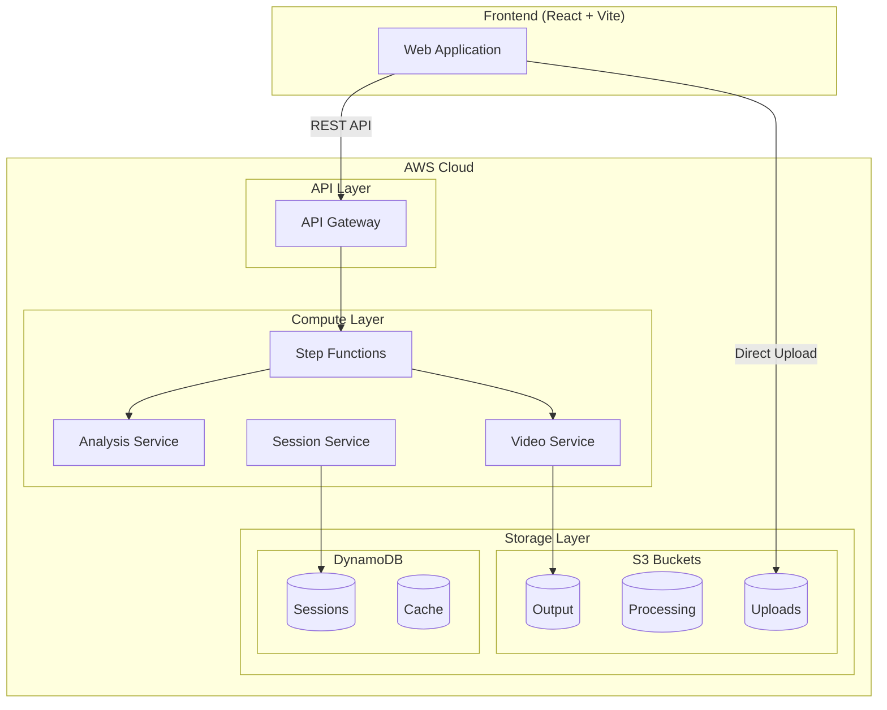
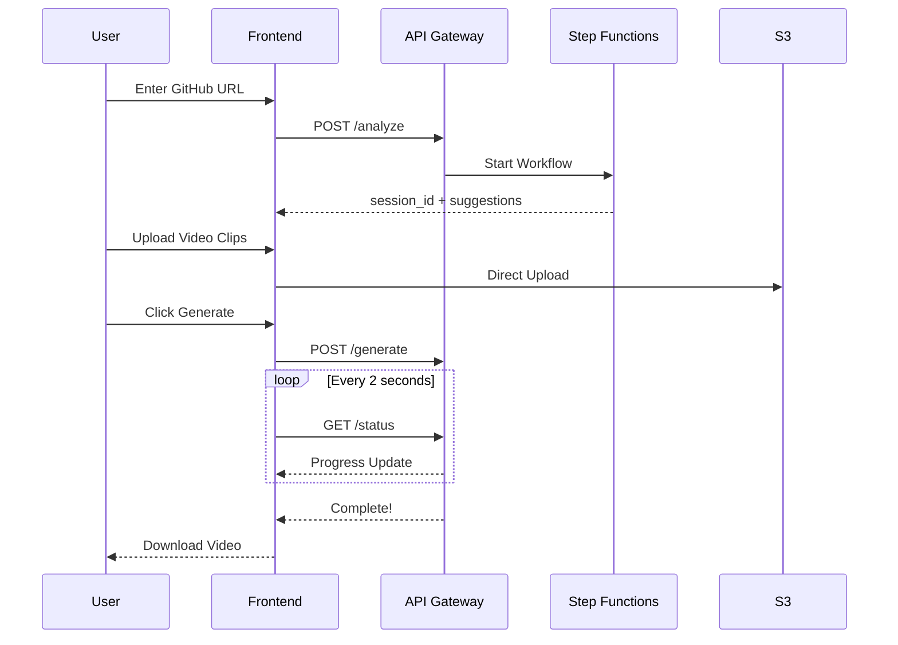
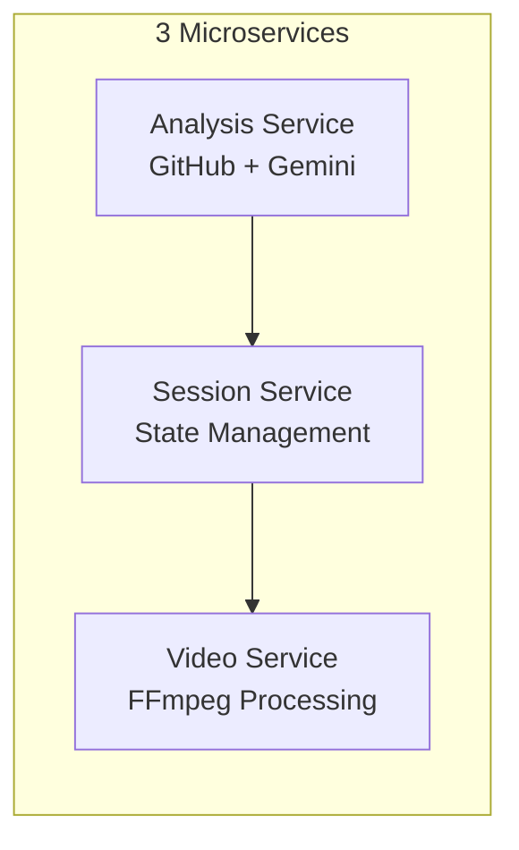
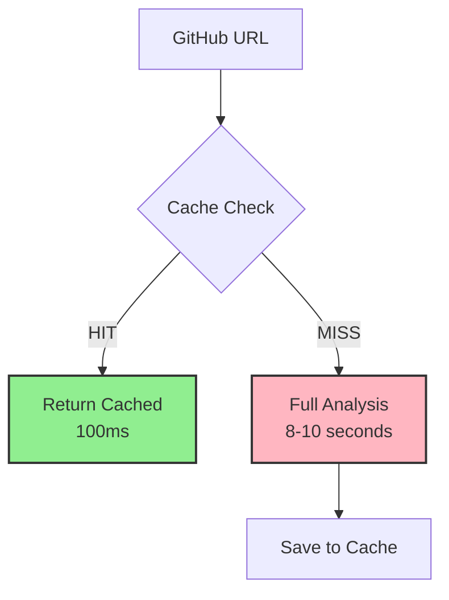

# 🎬 AI Demo Builder

> Automatically generate professional demo videos for GitHub repositories using AI

[](https://aws.amazon.com/)
[](https://react.dev/)
[](https://www.typescriptlang.org/)

## 🌟 Overview

AI Demo Builder analyzes your GitHub repository and generates intelligent suggestions for demo videos. Upload your screen recordings, and the system automatically stitches them into a professional demo video.

### Key Features

- 🤖 **AI-Powered Analysis** - Uses Gemini AI to understand your project
- 📹 **Smart Video Processing** - Validates, converts, and stitches videos
- ⚡ **Serverless Architecture** - Scales automatically, pay-per-use
- 🔄 **Real-time Updates** - Polling-based progress tracking

---

## 🏗️ System Architecture



---

## 📊 User Flow



---

## 🔧 Microservices



| Service | Responsibility | Key Tech |
|---------|---------------|----------|
| **Analysis Service** | Fetch GitHub repo, call Gemini AI | Python, GitHub API, Gemini |
| **Session Service** | Manage sessions, presigned URLs | Python, DynamoDB |
| **Video Service** | Validate, convert, stitch videos | Python, FFmpeg |

---

## 💾 Data Storage

### DynamoDB Tables

| Table | Partition Key | Sort Key | Purpose |
|-------|--------------|----------|---------|
| `sessions` | session_id | - | Track user sessions |
| `cache` | repo_url | commit_sha | Cache GitHub analysis |

### S3 Buckets

| Bucket | Lifecycle | Purpose |
|--------|-----------|---------|
| `uploads` | 7 days | Raw user video clips |
| `processing` | 1 day | Temporary processing files |
| `output` | 30 days | Final demo videos |

---

## 🔄 Caching Strategy



**Cache Key:** `repo_url + commit_sha`
- Same repo + same commit = Cache HIT
- Same repo + new commit = Cache MISS (re-analyze)

---

## 🚀 Getting Started

### Prerequisites

- AWS Account with CLI configured
- Node.js 18+
- Python 3.11+
- GitHub Personal Access Token
- Gemini API Key

### Deployment

```bash
# Clone repository
git clone https://github.com/yourusername/ai-demo-builder.git
cd ai-demo-builder

# Deploy infrastructure
cd infrastructure
npm install
cdk deploy --all

# Start frontend
cd ../frontend
npm install
npm run dev
```

---

## 📁 Project Structure

```
ai-demo-builder/
├── infrastructure/          # CDK (TypeScript)
│   └── lib/stacks/
│       ├── storage-stack.ts
│       ├── compute-stack.ts
│       └── api-stack.ts
├── services/                # Lambda (Python)
│   ├── analysis-service/
│   ├── session-service/
│   └── video-service/
├── frontend/                # React + Vite
│   └── src/
└── docs/                    # Documentation
```

---

## 🛠️ Tech Stack

| Layer | Technology |
|-------|------------|
| **Frontend** | React, Vite, Tailwind CSS, TypeScript |
| **API** | AWS API Gateway |
| **Compute** | AWS Lambda, Step Functions |
| **Storage** | S3, DynamoDB |
| **AI** | Google Gemini |
| **Video** | FFmpeg |
| **IaC** | AWS CDK (TypeScript) |

---

## 📈 Cost Estimate

Running on AWS Free Tier:

| Service | Free Tier | Estimated Cost |
|---------|-----------|----------------|
| Lambda | 1M requests/month | $0 |
| S3 | 5GB storage | $0 |
| DynamoDB | 25GB storage | $0 |
| API Gateway | 1M calls/month | $0 |
| **Total** | | **~$1/month** |

---

## 📄 License

MIT License - See [LICENSE](LICENSE) for details.

---

## Acknowledgments
- Powered by AWS Serverless
- AI suggestions by Google Gemini